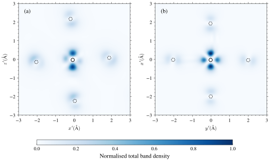

# CONQUEST2a

A [CONQUEST](https://github.com/OrderN/CONQUEST-release/) post-processing tool written in Python to do multiple, useful things:
- Convert between CONQUEST coordinates format and popular `.vasp` and `.(ext)xyz` formats for quick and easy visualisation, e.g. in [VESTA](https://jp-minerals.org/vesta/en/).
- Process `AtomCharge.dat` to visualise net spins or vectors
- Transform cells (generate supercells or transform cells like VESTA) keeping spin patterns and species numbers!
- Process and sort (p)DOS files into something easy to use for plotting
- Process and sort `BandStructure.dat` into something easy to use for plotting
- Nearest-neighbour searching
- Calculation of dihedral and planar angles
- Charge and band density post-processing
- Mapping between VESTA to CONQUEST coordinates

## Installation
Usage is simple. In your `venv`, simply
```
pip3 install numpy scipy ase matplotlib scienceplots conquest2a
```
If you are attempting to integrate this directly into your Nix devShell, this flake exposes it under `packages.default` The [devflake](https://github.com/chpxu/development-flake) in this repo automatically builds and adds it to the devshell environment.

> Note: if using SciencePlots<2.2.2 use matplotlib 3.10 or earlier.

## Usage

1. [Initialising your input](#initialising-your-input)
2. [Bandstructures](#bandstructures)
3. [pDOS](#pdos)
4. [kNN](#k-nearest-neighbours)
5. [Quantities](#quantities)
6. [Volumetric density](#charge-density)
7. [VESTA conversion](#vesta)

These steps assume you are already in the directory where `Conquest_input` and other relevant files sit. There is however, file path checking + absolute path resolution, for implementing when using in your own scripts, so relative paths _shouldn't_ be an issue.

### Initialising your input

First, import everything you might want to use:
```py
from conquest2a.conquest import conquest_species, conquest_coordinates # necessary for most things, (1)
from conquest2a.cell.transform import * # for cell transformations
from conquest2a.writers import * # to write output files to disk
from conquest2a.pdos import pdos # to process (p)DOS
from conquest2a.band import * # to process BandStructure.dat
from conquest2a.density import chden, bandden # to process cube files from CONQUEST
from conquest2a.read.quantities import * # to process static output files without ASE
from conquest2a.algo.nn import nearest_neighbours # for nearest-neighbour searching
```
Next, get the path to your Conquest coordinates file, and instantiate `(1)` as
```py
test_input = conquest_species({1: "Bi", 2: "Mn", 3: "O"}) # replace this dict with your dict
```

Your `dict` inside `conquest_species()` will represent be the Conquest species index to element label map. Note that the `dict` integers should match the ones specified in `Conquest_input` and the coordinates file. Please ensure that the element labels represent real elements - the code will error out if it isn't. Support for reading `Conquest_input` may arrive soon...

### k-Nearest Neighbours

Traditional nearest-neighbour methods involve searching all atoms and specifying an arbitrary cutoff which is expensive for ridiculously large systems (around tens or hundreds of thousands or more atoms).

CONQUEST2a gives each atom a number depending on their location in a Conquest coordinates file.

The algorithm used is a periodic KDTree, which automatically finds nearest neighbours using a binary tree. By specifying a number of neighbours $k$, you can then automatically get the $k$ closest neighbours, their interatomic distances, the element and their coordinates, assuming you initialised the Atoms correctly [above](#initialising-your-input). CONQUEST2a's implementation is a wrapper around [SciPy's KDTree](https://docs.scipy.org/doc/scipy/reference/generated/scipy.spatial.KDTree.html) to interface with the `Atom` class.

```py

from conquest2a.algo.nn import nearest_neighbours
conquest_map = conquest_species({1: "O", 2: "Bi", 3: "Mn", 4: "Mn", 5: "Mn", 6: "Mn"})
path = "./tests/data/test_output_input_coords.in"
coordsproc = conquest_coordinates_processor(path, conquest_map)
nn = nearest_neighbours(
    coordsproc, coordsproc.atoms[8]
)
nn.get_result(2) # Returns the interatomic distance in BOHR and the associated Atom
```

**WARNING**: to make index mapping easier, the first element is ALWAYS the atom you passed in to search around. E.g., to search for the **first** nearest neighbour, ensure the integer passed in to `get_result()` is **2**.

### Bandstructures

First, ensure `conquest2a.band` is imported at the start of your file.

Get the path to your bandstructure file, and initialise the `bst_processor` class:

```py
from conquest2a.band import *
test_bst = bst_processor("./tests/data/test_BandStructure.dat")
```

Now, all the bands have been stored in a list of `band`, and can be accessed as  `test_bst.bands`. The default CONQUEST BandStructure outputs all k-points as the "x-axis" for all bands and the specific options `Process.BandStrucAxis` may/may not work.

You can then just iterate through the `bands` list and plot, see `examples/plot_test_band.py`.

### pDOS

In CONQUEST, there are multiple types of density of states (DOS) output:

1. total DOS (TDOS)
2. partial DOS (PDOS), either $l$ (angular-momentum) resolved or $lm$-resolved for each atom

The relevant source is located in `conquest2a/pdos.py`.

To begin, first import the `pdos_processor` classes:
```py

from conquest2a.pdos import pdos_processor, pdos_l_processor, pdos_lm_processor
```

If you care only about the total DOS and nothing else, use `pdos_processor` with `lm = "t"`, i.e.:
```py
tdos = pdos_processor(conquest_rundir="/yourpath", lm="t")
tdos.read_file(tdos.all_pdos_files[0]) # reads "DOS.dat"
```

This will search your directory, here `/yourpath`, for `DOS.dat` (if parameter `lm = "t"`, which is the default), and store the results in `self.blocks`, where each element of the list is a numpy array of pdos values, in order of the spin. In CONQUEST, spins are output in ascending order, so the first "block" is for Spin 1 etc.

Alternatively, you can get CONQUEST to output angular momentum-resolved DOS. In this case, you can either use `pdos_l_processor` or `pdos_lm_processor` depending on whether you have `AtomXXXXXXX_l.dat` or `AtomXXXXXXX_lm.dat` files respectively. Since they are also different objects, you may use both too. The valid filenames are then stored in `self.all_pdos_files` as a list of strings. To extract the data from a file, follow the same format

```py
lmpdos = pdos_lm_processor(conquest_rundir="/yourpath") # lm is set automatically
lmpdos.read_file(lmpdos.all_pdos_files[0]) # reads, e.g. "Atom00000001_lm.dat" if that exists in your directory.
atom1 = lmpdos.blocks # NOTE: this is a SHALLOW COPY. If you do another read, this will be OVERWRITTEN
# atom1 = copy.deepcopy(lmpdos.blocks) # you may prefer to do this instead, if you need to read and store all the pdos output separately
```

Remark 1: in CONQUEST, you can choose to output pdos only for specific atoms, but nonetheless `self.all_pdos_files` will be in ascending order of atom number.

Remark 2: Reading pdos files automatically, and storing all of their data at once, is not implemented.

`pdos_lm_processor` and `pdos_l_processor` each have their own methods, `lm_map()` and `l_map()` respectively. This must be called after a read, e.g. as `lmpdos.lm_map()`. This groups each column of pdos files by their $(l,m)$ or $l$-value, thus forming a `dict` like
```py
{
  "0,0": [np.array(...), np.array(...)], # [spin 1, spin 2,....]
  "1,-1": [np.array(...), np.array(...)],
  "1,0": [np.array(...), np.array(...)],
  "1,1": [np.array(...), np.array(...)],
  # etc
}
```
where again the numpy arrays are in ascending order of spins. These dicts can be accessed as `processor_instance.lm_dict` or `processor_instance.l_dict`.

See `examples/plot_test_pdos.py` for an example of plotting the data obtained from a pDOS file.
### Quantities

As detailed on the [CONQUEST docs](https://conquest.readthedocs.io/en/latest/ase-conquest.html), you can manage it with [ASE](https://ase-lib.org/) indirectly by setting the flag `IO.WriteOutToASEFile True` in your `Conquest_input` file. Sometimes, you just forget to add flags when you need to, and then proceed to do numerous calculations without ASE, and thus `conquest2a/read/quantities.py` was created.

By pointing to a file from a static run, this module will fetch the free energy, Harris-Foulkes energy, DFT total energy, forces on each atom (and assign them to the right `Atom` instances), max force and total stresses from near the end of the file.

First, load your species dictionary correctly, according to your coordinates file. Then,

```py
from conquest2a.conquest import conquest_species, conquest_coordinates
from conquest2a.read.quantities import read_static_output
test_species = conquest_species({1: "Bi", 2: "Mn", 3: "O"})
test_coords = conquest_coordinates("./tests/data/test.dat", test_species)
output = read_static_output("tests/data/test_output.txt", test_coords_proc) # will do all the quantity fetching automatically

output.dft_energy
output.harris_foulkes_energy
#...
```

Forces can be accessed per atom.

### Density analysis
CONQUEST allows outputting both band and charge densities. See [CONQUEST post processing for more details](https://conquest.readthedocs.io/en/latest/post-proc.html) including file structure and file naming conventions.

The `density` class uses ASE's [`read_cube`](https://docs.ase-lib.org/_modules/ase/io/cube.html) function to load the volumetric data and atom information. This module is therefore completely independent of the rest of `conquest2a`. It takes in a list of paths, the Miller indices of the plane, the distance from this plane and a string of operations like "+-/" to apply to each subsequent file supplied, see the docs and example below.

To handle specifically charge density and band density, individual classes are supplied, called `chden` and `bandden`. These require the above parameters but instead of a list of paths, simply supply a directory to look for relevant files instead. `chden` will look for `charge_stub.cube` or `charge_stub_up|dn.cube` whilst `bandden` supports filtering by band number, spin and $k$-point. See [docs](https://conquest-to-vasp.readthedocs.io/en/latest/src/density.html) and example for more information.

The example plots a normalised total band density in an external Axes instance. It looks like this



### VESTA

VESTA is a very useful tool to set spin patterns using `Edit > Vectors`. CONQUEST2a now supports reading VESTA files with vector information to produce CONQUEST coordinate files. As always, the output should be checked before using it to start any simulation.

Usage:
```py
from conquest2a.read.vesta import vesta_to_conquest
from conquest2a.conquest import conquest_species

species = {1: "O", 2: "Bi", 3: "Co", 4: "Co", 5: "Mn", 6: "Mn"}
conqin = conquest_species(species_dict=species)

vesta_to_conquest(
        "tests/data/test_vesta_to_conquest.vesta",
        "tests/data/test_vesta_to_conquest.coords",
        conqin,
    )
```
In CONQUEST, to treat species with different spin (i.e. up/down, collinear spin only), the species entries must be duplicated inside the dictionary `species`. This library treats vectors $(0, 0, 1)$ as spin "up" and $(0, 0, -1)$ as spin "down" when inputting from VESTA. Additionally, it will set the lowest index corresponding to a species as spin up, and then spin down, so `5: "Mn", 6: "Mn"` will make species 5 be spin up and species 6 to be spin down, so make sure you check your `Conquest_input` correctly!

Please see the [docs](https://conquest-to-vasp.readthedocs.io/en/latest/index.html) for more information.
## CONTRIBUTING

Thank you for wanting to contribute. I am happy to see open issues or PRs on desired features, particularly pertaining to plotting and post-processing.